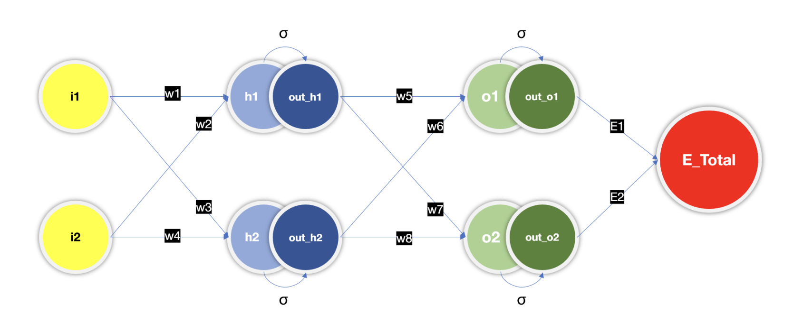
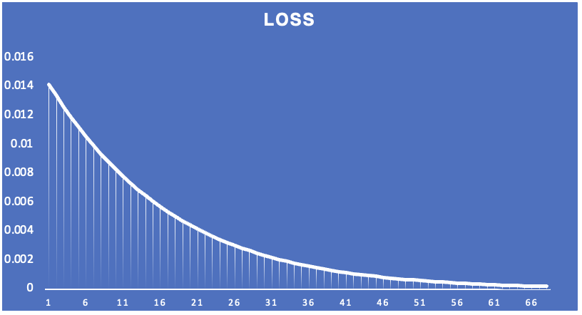
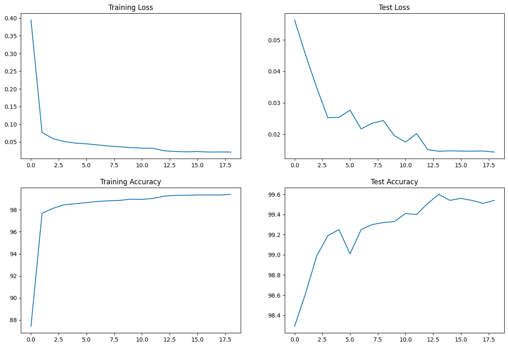

# Part1 : BackPropagation

BackPropagation.xlsx file in the root directory, It includes detailed mathematical computation of a Neural Network. It covers both forward and backward propagation computations and the Equatuions, Gradients required to set the final parameters(weights) of the model. For the sake of simplicity small and simple model has been considered. Below is the model configuration:

As we can see in the image, The model consists 1 input layer with 2 input neurons, 1 hidden layer with 2 neurons, 1 output layer with 2 targets.

Let's See the Equations of computation.

Note: Sigmoid is used as a non linearity function.

### Forward Propagation
|Layer|Equation|Description|
|-----|--------|-----------|
|Hidden Layer|h1 = w1*i1 + w2*i2|To compute the value of 1st neuron of hidden layer.|
||a_h1 = σ(h1) = 1/(1 + exp(-h1))|To apply sigmoid function over h1|
||h2 = w3*i1 + w4*i2|To compute the value of 2nd neuron of hidden layer.|
||a_h2 = σ(h2) = 1/(1 + exp(-h2))|To apply sigmoid function over h2|
|Output Layer|o1 = w5*a_h1 + w6*a_h2|To compute the value of 1st neuron of output layer.|
||a_o1 = σ(o1)|To apply sigmoid function over o1|
||o2 = w7*a_h1 + w8*a_h2|To compute the value of 2nd neuron of output layer.|
||a_o2 = σ(o2)|To apply sigmoid function over o2|
|Error|E_total = E1 + E2|Total Error of the model on 1 epoch|
||E1 = ½ * (t1 - a_o1)²|Error of 1st output|
||E2 = ½ * (t2 - a_o2)²|Error of 2nd output|

### Back propagation
|Differential Equation|Simplified Equation|Description|
|---------------------|-------------------|-----------|
|∂E_total/∂w5 = ∂(E1 + E2)/∂w5|∂E_total/∂w5 = (a_01 - t1) * a_o1 * (1 - a_o1) *  a_h1|Since E1 is independent of E2, hence ∂E_total/∂w5 = ∂E1/∂w5, Partial derivation for finding gradient of E1 w.r.t W5 is : ∂E_total/∂w5 = ∂E1/∂w5 = ∂E1/∂a_o1*∂a_o1/∂o1*∂o1/∂w5. In simplfied equation column you can see the final equation to get the gradient.|
|∂E_total/∂w6|∂E_total/∂w6 = (a_01 - t1) * a_o1 * (1 - a_o1) *  a_h2|Same as w5.|
|∂E_total/∂w7|∂E_total/∂w7 = (a_02 - t2) * a_o2 * (1 - a_o2) *  a_h1||
|∂E_total/∂w8|∂E_total/∂w8 = (a_02 - t2) * a_o2 * (1 - a_o2) *  a_h2||
||||
|∂E1/∂a_h1 = ∂E1/∂a_o1 * ∂a_o1/∂o1 * ∂o1/∂a_h1|∂E1/∂a_h1 = (a_01 - t1) * a_o1 * (1 - a_o1) * w5|To get the gradient of E1 w.r.t a_h1, we can use ∂E1/∂O1 * ∂o1/∂a_h1. By substituting the already computed derivations we get the simplified eqn.|
|∂E2/∂a_h1 = ∂E2/∂a_o2 * ∂a_o2/∂o2 * ∂o2/∂a_h1|∂E2/∂a_h1 = (a_02 - t2) * a_o2 * (1 - a_o2) * w7|Same as a_h1|
|∂E_Total/∂a_h1 = ∂E1/∂a_h1 + ∂E2/∂a_h1|∂E_Total/∂a_h1 = (a_o1 - t1) * a_o1 * (1-a_o1) * w5 + (a_o2 - t2) * a_o2 * (1-a_o2) * w7|Sum of ∂E1/∂a_h1 and ∂E2/∂ah_1|
|∂E_Total/∂a_h2 = ∂E1/∂a_h2 + ∂E2/∂a_h2|∂E_Total/∂a_h2 = (a_o1 - t1) * a_o1 * (1-a_o1) * w6 + (a_o2 - t2) * a_o2 * (1-a_o2) * w8|Same as a_h1|
||||
|∂E_Total/∂w1 =  ∂E_Total/∂a_h1 * ∂a_h1/∂h1 * ∂h1/∂w1|∂E_Total/∂w1 =  (a_o1 - t1) * a_o1 * (1-a_o1) * w5 + (a_o2 - t2) * a_o2 * (1-a_o2) * w7 * a_h1 * (1 - a_h1) * i1|To find the gradients of weights in first layer (w1, w2, w3, w4) We can use gradient we have found for a_h1 & a_h2 accordingly in the partial differential equation extended for w1, w2, w3, w4.|
|∂E_Total/∂w2 =  ∂E_Total/∂a_h1 * ∂a_h1/∂h1 * ∂h1/∂w2|∂E_Total/∂w2 =  (a_o1 - t1) * a_o1 * (1-a_o1) * w5 + (a_o2 - t2) * a_o2 * (1-a_o2) * w7 * a_h1 * (1 - a_h1) * i2||
|∂E_Total/∂w3 =  ∂E_Total/∂a_h2 * ∂a_h2/∂h2 * ∂h2/∂w3|∂E_Total/∂w3 =  (a_o1 - t1) * a_o1 * (1-a_o1) * w6 + (a_o2 - t2) * a_o2 * (1-a_o2) * w8 * a_h2 * (1 - a_h2) * i1||
|∂E_Total/∂w4 =  ∂E_Total/∂a_h2 * ∂a_h2/∂h2 * ∂h2/∂w4|∂E_Total/∂w4 =  (a_o1 - t1) * a_o1 * (1-a_o1) * w6 + (a_o2 - t2) * a_o2 * (1-a_o2) * w8 * a_h2 * (1 - a_h2) * i2||

## Loss
Based on the Equations of forward and backward propagation we can calculate the loss for random inputs with some randomly initialized weights.
Let say we have passed inputs as:
1. i1 = 0.05
2. i2 = 0.1

and our target values are :
1. t1 = 0.5
2. t2 = 0.5

With learning rate as η = 1, Following is the plot of loss vs no. of epochs.

		

# Part 2 | Image Classifier

This is a Machine learning model to predict the digit between 0-9 from the image containing a hendwritten digit init. Model is a Deep Learning Convolutional Neural Network.

***

## Usage
Following are the 3 files present in the repository that are required to train the model and test it's performance.

### model.py
This is the file where the model structure is defined. it's a Convolution Neural Network model which has some convolutional layer followed by linear layers to predict the output class based on input image.

#### Summary
Below is the summary of the model.

----------------------------------------------------------------
|Layer (type)|Output Shape|Param #|
|------------|------------|-------|
|      Conv2d-1|[-1, 16, 28, 28]|  160|
|        ReLU-2|[-1, 16, 28, 28]|    0|
|     Dropout-3|[-1, 16, 28, 28]|    0|
| BatchNorm2d-4|[-1, 16, 28, 28]|   32|
|      Conv2d-5|[-1, 16, 28, 28]|2,320|
|        ReLU-6|[-1, 16, 28, 28]|    0|
|     Dropout-7|[-1, 16, 28, 28]|    0|
| BatchNorm2d-8|[-1, 16, 28, 28]|   32|
|      Conv2d-9|[-1, 16, 28, 28]|2,320|
|       ReLU-10|[-1, 16, 28, 28]|    0|
|  MaxPool2d-11|[-1, 16, 14, 14]|    0|
|     Conv2d-12|[-1, 16, 12, 12]|2,320|
|       ReLU-13|[-1, 16, 12, 12]|    0|
|    Dropout-14|[-1, 16, 12, 12]|    0|
|BatchNorm2d-15|[-1, 16, 12, 12]|   32|
|     Conv2d-16|[-1, 16, 10, 10]|2,320|
|       ReLU-17|[-1, 16, 10, 10]|    0|
|    Dropout-18|[-1, 16, 10, 10]|    0|
|BatchNorm2d-19|[-1, 16, 10, 10]|   32|
|     Conv2d-20|  [-1, 16, 8, 8]|2,320|
|       ReLU-21|  [-1, 16, 8, 8]|    0|
|BatchNorm2d-22|  [-1, 16, 8, 8]|   32|
|     Conv2d-23|  [-1, 16, 6, 6]|2,320|
|       ReLU-24|  [-1, 16, 6, 6]|    0|
|     Conv2d-25|  [-1, 32, 4, 4]|4,640|
|     Conv2d-26|  [-1, 10, 4, 4]|  330|
|  AvgPool2d-27|  [-1, 10, 1, 1]|    0|

Total params: 19,210

Trainable params: 19,210

Non-trainable params: 0

----------------------------------------------------------------

Input size (MB): 0.00

Forward/backward pass size (MB): 1.14

Params size (MB): 0.07

Estimated Total Size (MB): 1.21

----------------------------------------------------------------

***

### utils.py
In this file some important and reusable functions are defined that can be imported and used inside the project while training or testing the model Or visualising input Data.

***

### S5.ipynb
This is the notebook where dataset, dataset transformation and dataloaders are defined.
There are also the blocks of code present to visualise and understand the input images.
Finally model from model.py and functions from utils.py are imported in the notebook to train the model and test it's accuracy.

***
## Model Performance
Current model performance based on the model architecture mentioned above in summary:

Train Accuracy : 99.30

Test Accuracy : 99.60

Graphs :

